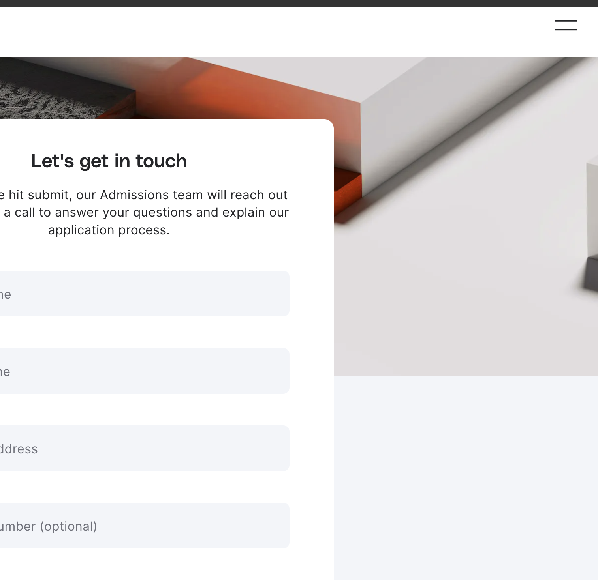

# Hello, this is my README file

## My first day on GitHub Today

I learned that version control is an **essential part** of my career as web developer. Some keywords that I should remember for later are: git, GitHub, version control, repository, commit and hash. The next 3 months will be a very exciting time, as I will learn new things every day.

- My first bullet
- Another bullet
- Another bullet
- Another bullet
- Another bullet

